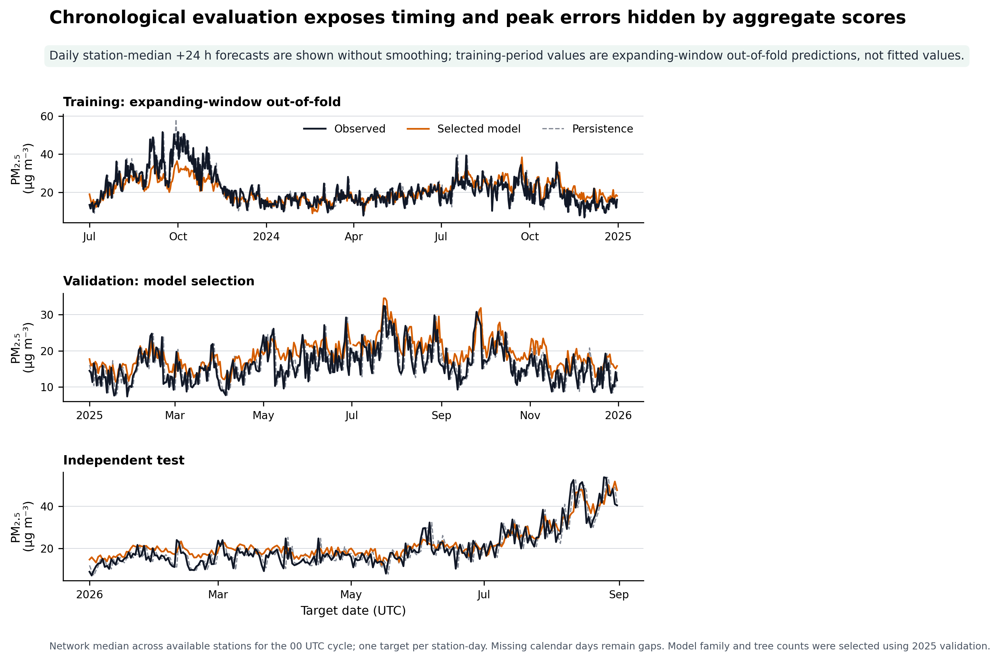
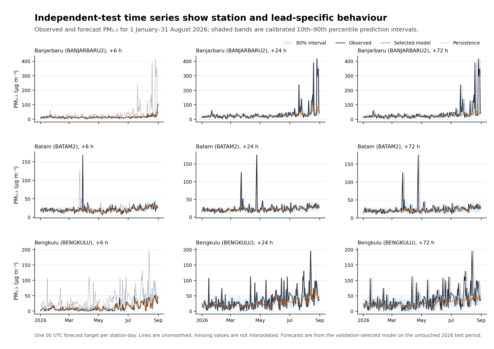
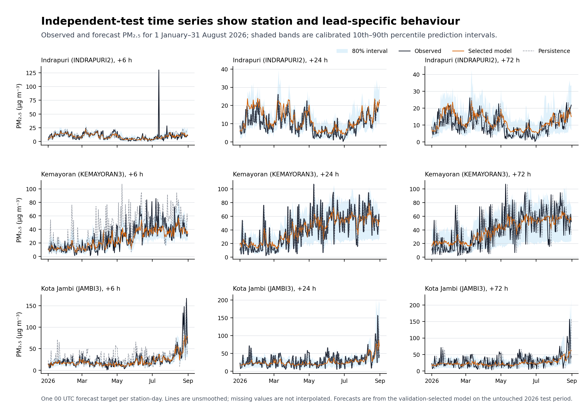
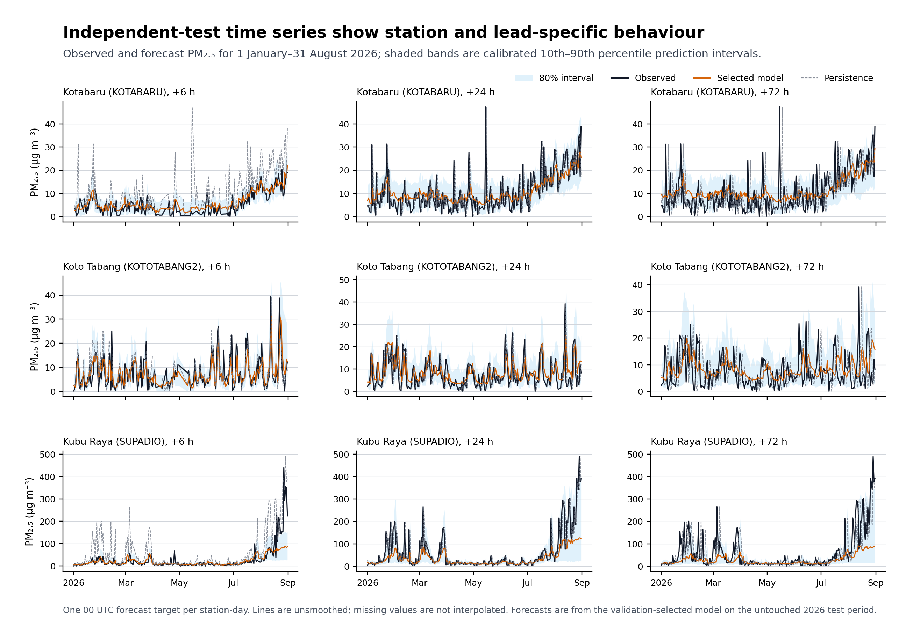
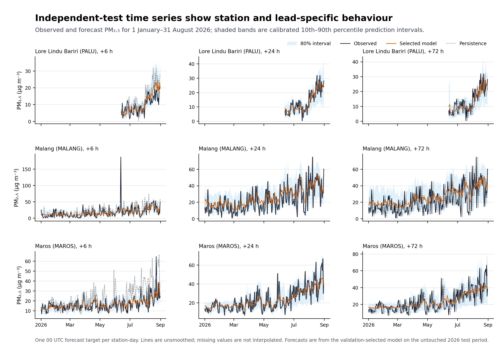
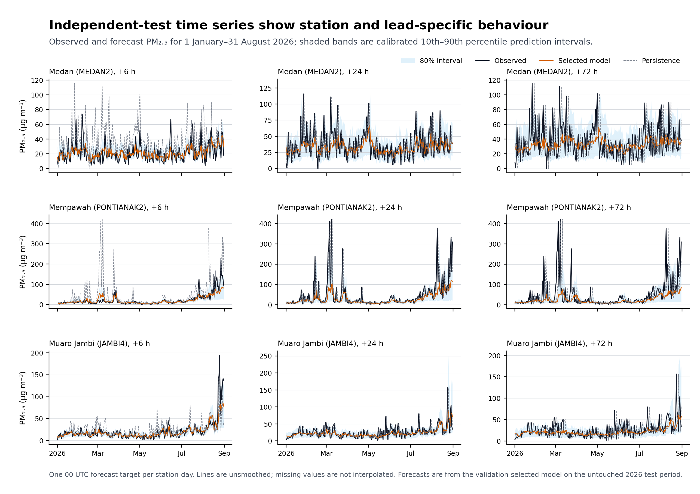
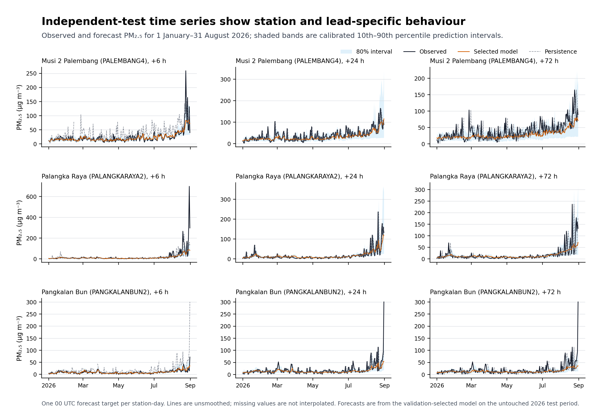
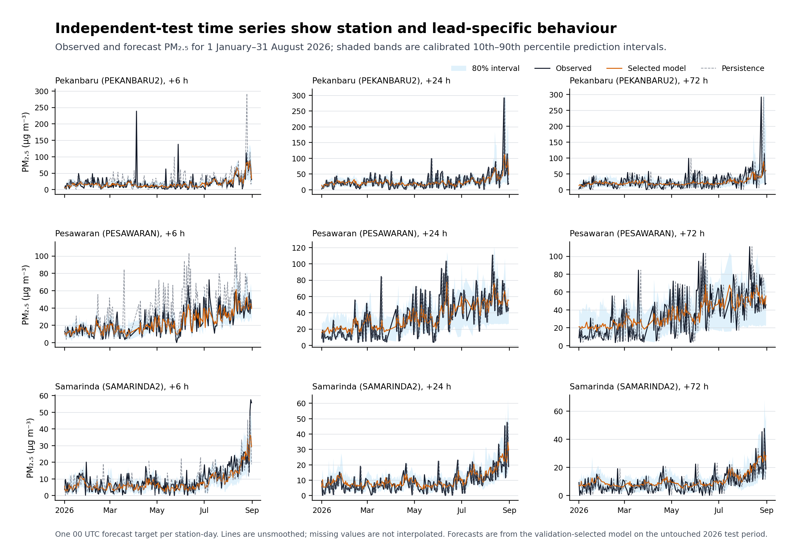
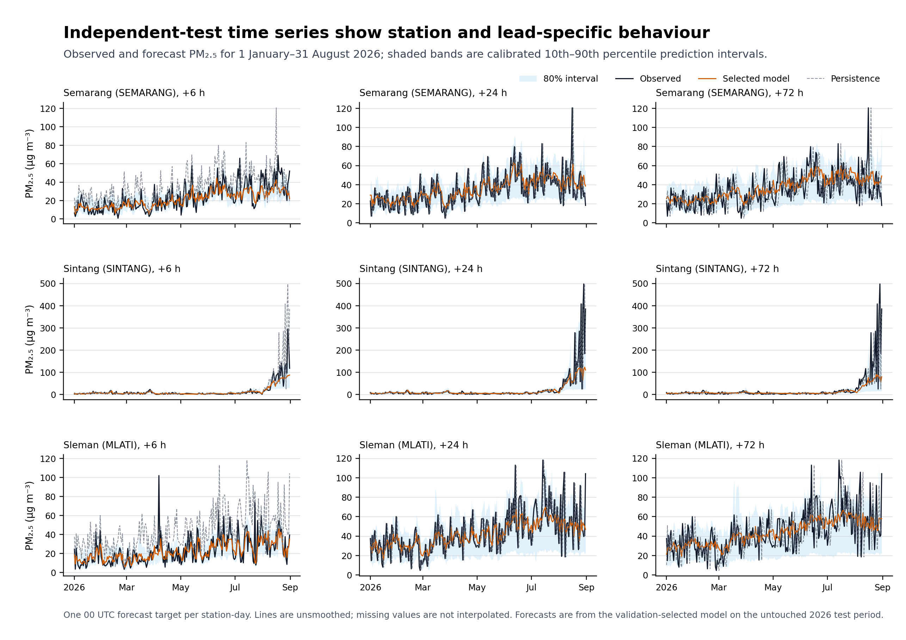
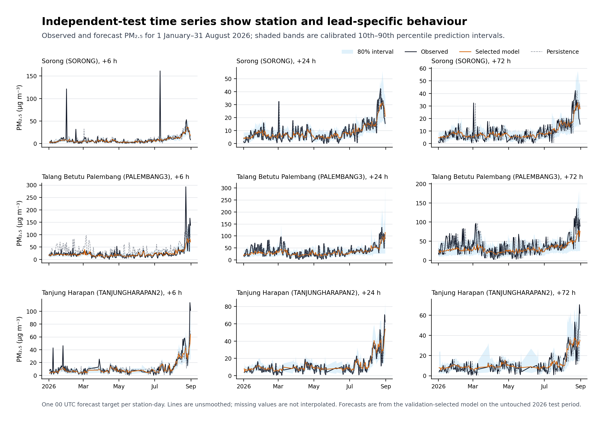

# Research-to-operational hourly PM₂.₅ forecasting at 27 Indonesian stations

**Experimental model-development report — not yet an operational public product** 
**Evaluation completed:** 04 September 2026 
**Forecast cycle evaluated:** 00 UTC daily 
**Forecast leads:** +3, +6, +12, +24, +48, and +72 hours

## Executive finding

The validation-selected model is **CAMS model-output-statistics LightGBM**. Across the six lead times in the untouched 1 January–31 August 2026 test period, its mean station-balanced mean absolute error (MAE) is **9.82 µg m⁻³**, corresponding to **+28.5%** mean skill relative to persistence and **+34.2%** relative to raw CAMS. Improvement occurs in **94.4%** of station–lead combinations, so aggregate skill does not imply uniform local benefit. The nominal 80% prediction intervals attain **78.8%** mean test coverage across leads.

**Operational decision:** retain the system as **pre-operational**. It is suitable for scheduled shadow forecasts and scorecard monitoring, but public or duty-forecaster reliance should wait for prospective evaluation, explicit input-latency tests, a second forecast cycle, and an assessment of forecast meteorology. The model provides prediction, not source attribution or causal explanation.

## 1. Question and intended use

The question is whether a pooled machine-learning model can improve station-level hourly PM₂.₅ forecasts over simple persistence at 27 BMKG locations while remaining computationally light enough for routine operation. One direct model is fitted for each forecast lead; direct forecasting avoids recursive error propagation. The intended output is a concentration forecast in µg m⁻³ plus a calibrated uncertainty interval at each observed station.

The primary inference domain is the existing network. A separate station-holdout experiment asks a harder question: how well the approach transfers to a location absent from fitting. Neither experiment creates a continuous spatial concentration field.

## 2. Data, quality control, and provenance

The supplied archive contains **1,158,532** rows from 27 hourly station files spanning 2021-01-01 to 2026-08-31. After applying documented error rules, **1,116,030 (96.33%)** source rows contain valid PM₂.₅. Exact duplicated station-hours were removed only in derived data; no conflicting duplicate key was accepted. Negative PM₂.₅ and values at or above 985 µg m⁻³ were treated as instrument error values. Plausible extremes below the cutoff were retained.

Relative humidity outside (0, 100]% and temperature outside −10 to 50 °C were made unavailable as predictors without altering PM₂.₅. This screening identified a block of physically impossible temperature values at Koto Tabang; the values were not corrected or imputed. Median station-level valid PM₂.₅ coverage within each station's observed span is **94.3%**.

CAMS global atmospheric-composition forecast PM₂.₅ was extracted from the official `ECMWF/CAMS/NRT` Earth Engine mirror [7] and bilinearly sampled to station coordinates. Source mass density in kg m⁻³ was converted explicitly to µg m⁻³. The parent CAMS service provides global atmospheric-composition forecasts twice daily on a 0.4° grid and is an atmospheric model product, not a surface observation [1]. The mirror is three-hourly, so +3 h is the earliest evaluated lead; no +1 h field was synthesized.

The extract retained **215,916 of 216,918 station–issue–lead records (99.54%)**. Missing records comprise a partial spatial gap on 17–23 February 2024 and a fully missing 00 UTC initialization on 30 June 2025. They were not imputed. An independent direct Copernicus archive check covered 20 in-domain stations and five common leads on 1 January 2026. At 100 native grid-point comparisons, the maximum absolute difference was 0.000017 µg m⁻³; station-resampling implementations differed by 0.107 µg m⁻³ on average and 1.217 µg m⁻³ at most. This supports identity of the underlying field while documenting interpolation-level differences. The bounded experiment uses CAMS PM₂.₅ plus observed temperature and humidity histories; forecast meteorology is a declared next-stage input.

*Figure 1. Monthly valid PM₂.₅ coverage across the 27 stations. Missing coverage is distinct from a valid zero concentration.*

## 3. Prediction design

### 3.1 Inputs

Predictors use only timestamps at or before issue time: PM₂.₅ lags from 0 to 168 h; temperature and relative-humidity lags to 24 h; rolling PM₂.₅ mean, standard deviation, maximum, and availability over 3–168 h; local-hour and annual-cycle encodings; station coordinates and region; the contemporaneous network mean; a distance-weighted nearby-station mean within 400 km; and forecast-valid CAMS PM₂.₅. Missing predictor values are retained for native tree handling. Feature importance is diagnostic and not causal importance.

### 3.2 Chronological separation

Targets from 2023–2024 form training, 2025 is used for point-model early stopping and model choice, and 2026 through 31 August is evaluated once as the final test. The uncertainty workflow adds a nested temporal separation: January–June 2025 is used only to tune quantile tree counts, while July–December 2025 is reserved exclusively for conformal calibration. Splits are assigned by target time, not issue time. The derived table contains **216,918** station–issue–lead rows and **200,724** valid targets. Automated audits found 0 duplicate modeling keys, 0 non-future targets, and no target-time overlap among train, validation, and test. Chronological and station-blocked validation are used because random splitting of structured environmental data can underestimate predictive error [6].

### 3.3 Models and uncertainty

Persistence and a training-only station/local-time climatology are reference forecasts. Candidate learners are observation-only LightGBM, CAMS model-output-statistics (MOS) LightGBM, and CAMS MOS XGBoost. Gradient-boosted trees represent nonlinear interactions and missingness without the compute cost of deep sequence models [3,4]. CAMS bias calibration with machine learning has prior scientific precedent, although performance is domain-specific [2].

Point and quantile predictions are clipped only at the physical lower bound of 0 µg m⁻³. Quantile LightGBM estimates the 10th, 50th, and 90th conditional percentiles. Quantile crossing is removed by sorting, then a lead-specific split-conformal expansion is estimated from the held July–December 2025 calibration block pooled across stations. Neither fitting nor interval calibration accesses 2026. Conformalized quantile regression provides a principled basis for adaptive prediction intervals under exchangeability assumptions [5]; temporal autocorrelation and later CAMS system changes mean empirical monitoring remains necessary.

## 4. Validation selection and independent test results

Model choice used the mean station-balanced validation MAE across all six leads. The specified tie-break prefers CAMS LightGBM when it lies within 1% of the minimum, reducing deployment complexity while retaining a physically based forecast input.

| Candidate | Validation MAE | Skill vs persistence (%) | Selected |
| --- | --- | --- | --- |
| CAMS MOS LightGBM | 7.12 | 28.7 | Yes |
| CAMS MOS XGBoost | 7.16 | 28.0 | No |
| Observation-only LightGBM | 7.19 | 28.3 | No |

The selected model's validation criterion is **7.12 µg m⁻³**. The following table reports the subsequently opened test set. MAE and root-mean-square error (RMSE) are in µg m⁻³; positive bias means overprediction. The confidence interval is a 1,000-replicate station-week block bootstrap for mean absolute-error improvement over persistence. A positive interval entirely above zero supports lower mean absolute error under that block-resampling design.

| Lead (h) | n | MAE | Persistence MAE | Raw CAMS MAE | Skill (%) | RMSE | Bias | r | 95% CI: MAE gain |
| --- | --- | --- | --- | --- | --- | --- | --- | --- | --- |
| +3 | 5,918 | 7.62 | 12.64 | 9.95 | 36.5 | 16.48 | -2.36 | 0.73 | [3.79, 6.29] |
| +6 | 5,753 | 6.29 | 14.18 | 7.91 | 48.0 | 13.44 | -1.58 | 0.72 | [7.26, 9.59] |
| +12 | 5,897 | 10.50 | 16.69 | 17.61 | 32.9 | 16.62 | -2.23 | 0.58 | [5.77, 8.14] |
| +24 | 5,859 | 10.84 | 13.11 | 17.51 | 17.6 | 19.55 | -3.43 | 0.66 | [1.02, 2.45] |
| +48 | 5,839 | 11.66 | 13.90 | 18.10 | 16.9 | 21.39 | -4.41 | 0.59 | [0.99, 3.10] |
| +72 | 5,832 | 12.03 | 14.68 | 18.55 | 19.2 | 21.83 | -4.45 | 0.57 | [1.16, 3.50] |

*Figure 2. Station-balanced test MAE by lead for all candidates and reference forecasts.*

*Figure 3. Selected-model MAE skill relative to persistence for every station and lead.*

### 4.1 Chronological behaviour across development stages

Aggregate errors do not show whether the forecast follows the timing of individual episodes, reacts late, or compresses peaks. Figure 4 therefore compares the observed and predicted +24 h sequences in their original target-time order. For readability, each point is the daily median across stations with valid data; no temporal smoothing or interpolation is applied.

Training-period values are not fitted predictions. They use three expanding-window assessment blocks: July–December 2023, January–June 2024, and July–December 2024. Every assessment target is later than all targets used to fit its fold. However, the displayed model family and tree counts were selected later using 2025 validation, so this retrospective out-of-fold diagnostic describes temporal behaviour and must not be treated as an independent model-selection score. The 2025 panel is validation evidence and the 2026 panel remains the independent test.

*Figure 4. Chronological observed, selected-model, and persistence PM₂.₅ at +24 h for expanding-window out-of-fold training assessments, validation, and independent testing. Values are daily station medians for the 00 UTC forecast cycle.*

The nine-page station atlas is integrated into Appendix B of this report. It shows the complete independent-test sequences at +6, +24, and +72 h for all 27 stations, including calibrated 10th–90th percentile intervals, so poor-performing stations and short-lived episodes remain inspectable rather than being concealed by national aggregation.

### 4.2 Incremental value of CAMS

Relative to the otherwise identical observation-only LightGBM, adding forecast-valid CAMS PM₂.₅ reduced station-week-balanced MAE by **0.065 µg m⁻³** in validation (95% bootstrap interval 0.034 to 0.098) and **0.178 µg m⁻³** in the independent test (95% interval 0.119 to 0.242). This is an aggregate predictive association, not causal evidence. Test-period gains are clearest at +3 to +12 h; intervals cross zero at each of +24, +48, and +72 h, so longer-lead incremental benefit remains inconclusive individually.

| Lead (h) | MAE gain | Relative gain (%) | 95% CI | Station-weeks |
| --- | --- | --- | --- | --- |
| +3 | 0.295 | 3.34 | [0.194, 0.394] | 945 |
| +6 | 0.390 | 5.43 | [0.286, 0.489] | 944 |
| +12 | 0.240 | 2.17 | [0.165, 0.315] | 944 |
| +24 | 0.012 | 0.11 | [-0.179, 0.184] | 945 |
| +48 | 0.045 | 0.36 | [-0.057, 0.143] | 945 |
| +72 | 0.089 | 0.68 | [-0.033, 0.222] | 945 |
| All leads | 0.178 | 1.65 | [0.119, 0.242] | 945 |

The five least favourable station–lead combinations include SINTANG (-15.2%), SUPADIO (-13.1%), SUPADIO (-12.9%), SINTANG (-10.2%), SUPADIO (-9.5%). These are failure modes for investigation, not grounds for deleting observations or selectively omitting stations.

*Figure 5. Observed versus selected-model PM₂.₅ at +24 h and +72 h. The display is truncated at the pooled 99.5th percentile only for visual legibility; metrics use the full valid range.*

## 5. Uncertainty and high-concentration performance

| Lead (h) | n | Coverage (%) | Mean width | Interval score |
| --- | --- | --- | --- | --- |
| +3 | 6,050 | 79.4 | 19.8 | 42.3 |
| +6 | 5,905 | 79.3 | 17.7 | 33.0 |
| +12 | 6,108 | 81.1 | 34.0 | 53.0 |
| +24 | 6,084 | 78.0 | 31.7 | 53.4 |
| +48 | 6,084 | 77.5 | 32.3 | 57.6 |
| +72 | 6,084 | 77.5 | 32.5 | 60.6 |

*Figure 6. Independent empirical coverage and mean width of the nominal 80% intervals.*

High-concentration events are defined separately for each station and lead using the station's training-period 90th percentile. This makes the test threshold independent of test outcomes while avoiding an arbitrary network-wide concentration cutoff. Probability of detection (POD) is the fraction of observed events detected; false-alarm ratio (FAR) is the fraction of predicted events that did not occur; critical success index (CSI) penalizes both misses and false alarms.

| Lead (h) | Hits | Misses | False alarms | POD (%) | FAR (%) | CSI (%) |
| --- | --- | --- | --- | --- | --- | --- |
| +3 | 392 | 322 | 148 | 54.9 | 27.4 | 45.5 |
| +6 | 403 | 314 | 125 | 56.2 | 23.7 | 47.9 |
| +12 | 225 | 475 | 85 | 32.1 | 27.4 | 28.7 |
| +24 | 357 | 423 | 148 | 45.8 | 29.3 | 38.5 |
| +48 | 280 | 500 | 153 | 35.9 | 35.3 | 30.0 |
| +72 | 252 | 528 | 154 | 32.3 | 37.9 | 27.0 |

*Figure 7. High-concentration event performance on the independent test period.*

## 6. Robustness, spatial transfer, and interpretation

The same-network test estimates performance for stations represented in training. Five station folds provide a separate transfer diagnostic: each held station is tested with a model fitted to the remaining stations and without station identity. Fold assignment is independent of target values.

| Lead (h) | Stations | MAE | Skill vs persistence (%) |
| --- | --- | --- | --- |
| +3 | 27 | 7.78 | 35.0 |
| +6 | 27 | 6.50 | 46.4 |
| +12 | 27 | 11.29 | 25.6 |
| +24 | 27 | 11.09 | 14.1 |
| +48 | 27 | 11.98 | 13.0 |
| +72 | 27 | 12.42 | 14.4 |

*Figure 8. Performance when test stations are excluded from model fitting.*

The 2024-only training sensitivity holds model form and tree counts fixed, changing only the fitting window. A positive difference means the shorter window has higher test MAE.

| Lead (h) | Frozen MAE | 2024-only MAE | Difference |
| --- | --- | --- | --- |
| +3 | 7.62 | 7.85 | 0.24 |
| +6 | 6.29 | 6.63 | 0.34 |
| +12 | 10.50 | 10.99 | 0.49 |
| +24 | 10.84 | 11.28 | 0.44 |
| +48 | 11.66 | 12.01 | 0.35 |
| +72 | 12.03 | 12.39 | 0.36 |

Distribution-shift diagnostics compare predictor missingness, standardized mean differences, and population stability index between training and test. These statistics identify monitoring candidates; they do not by themselves establish that a shift caused an error. Residual bias is also stratified by station, target month, and local target hour.

*Figure 9. Mean fitted-tree feature importance for the selected model. Correlated predictors can exchange importance.*

*Figure 10. Selected-model mean residual by target month and lead.*

## 7. Computational requirements and operational design

The experiment is designed for a CPU workstation; no GPU is required. Training uses at most 8 CPU threads. Measured peak memory was **preparation 1.43 GiB, training 0.81 GiB**. Measured preparation time was **92.9 s**, candidate/uncertainty/transfer evaluation was **103.5 s**, and deployment refitting was **24.4 s**. The complete deterministic pipeline took **4.7 min** across its latest successful stage measurements. The serialized deployment bundle is **9.8 MiB**. Warm inference across all point, fallback, and interval models totals approximately **0.136 s** on this workstation, excluding model loading, input download, and feature preparation. The measured prepared-input end-to-end command took **2.13 s** for 162 station–lead rows.

For a routine 00 UTC run, a practical allocation is **4–8 CPU cores, 4 GiB RAM, and 2 GiB working storage**. Model inference itself should finish in under one minute; CAMS acquisition is network- and service-limited and should be budgeted at **5–30 minutes** with retries. The initial 3.7-year Earth Engine backfill required **12.7 min** of measured server-query time. A full deterministic research rebuild should be budgeted at **5–15 minutes** on a comparable CPU workstation, while slower CPUs and uncached report dependencies may require longer.

The operational command reads prepared issue-time features and forecast-valid CAMS values, writes one row per station and lead, and records a model-manifest checksum. Deployment point models are refitted through December 2025; deployment quantile models stop at June 2025 so July–December remains a held calibration block. If CAMS PM₂.₅ is missing, a separately fitted observation-only point forecast is used and the status is marked degraded; calibrated intervals are withheld. Observation older than six hours is explicitly flagged. This fallback supports continuity but must not be presented as equivalent quality.

### 7.1 Implemented daily shadow workflow

The non-public shadow workflow is scheduled daily at 17:15 WIB (10:15 UTC). It saves an immutable BMKG dashboard snapshot, freezes the observation cutoff, acquires the current CAMS 00 UTC initialization directly from the Copernicus archive, writes atomic forecasts with hashes and freshness/status fields, and scores them only after observations appear. It retains first-seen station-hour values for verification and preserves later raw snapshots so revisions remain auditable. There is no public upload.

The first end-to-end engineering run on 4 September 2026 generated **162 rows in 67.7 s** with **0 degraded rows**. It produced **108 prospectively eligible rows** and labelled **54 rows** whose target times had already occurred. This first execution is a workflow test, not a prospective performance result.

That engineering run completed **11.3 h after the 00 UTC initialization**. Observation freshness in the shadow output is therefore evaluated relative to actual generation time as well as model initialization; otherwise an observation timestamped at 00 UTC would be incorrectly described as fresh roughly eleven hours later.

The operational sequence is:

1. Retrieve and validate the 00 UTC CAMS forecast after publication.
2. Freeze the latest observation cutoff and record station freshness.
3. Construct predictors without accessing any later observation.
4. Produce forecasts, intervals, status flags, hashes, and logs.
5. Score forecasts when observations arrive; retain missing cases rather than backfilling them silently.
6. Record warnings for missing CAMS, stale station data, schema/version changes, degraded operation, extreme residuals, and interval undercoverage.

## 8. Limitations and readiness gates

- The model has been retrospectively tested at one daily cycle only. It is not evidence for 12 UTC or arbitrary issue times.
- Direct CAMS availability is later than model initialization. At the installed schedule, +3 h and +6 h are latency diagnostics rather than prospective forecasts; +12 h is eligible only if generation completes before 12 UTC. Prospective reporting uses the stored per-row eligibility flag.
- The test period covers eight months of 2026, not a complete annual cycle, and no prospective shadow period has yet been observed.
- CAMS has a much coarser footprint than a station and its forecasting system can change over time; a sampled grid value is not a station measurement.
- The CAMS mirror is 99.54% complete for the specified station–issue–lead grid; missing cycles are excluded from primary complete-case comparisons and require the declared degraded fallback in operations.
- Forecast meteorology was not included in this bounded archive acquisition. Observed meteorology is available only at and before issue time and cannot represent future dispersion conditions.
- The network and station records are heterogeneous. Missingness, maintenance, relocation, calibration change, and evolving reporting latency can alter performance.
- Lead-specific conformal calibration pooled across stations assumes exchangeability more strongly than an autocorrelated, spatially dependent forecast archive warrants. The later calibration block prevents fitting leakage, but held-out empirical coverage is still reported rather than guaranteed operationally.
- Station-transfer results concern these 27 locations and do not validate a continuous spatial map or an arbitrary new station.
- Feature importance describes predictive use within fitted trees; it is not emissions, wildfire, transport, contribution, or causal attribution.

Before public operations, require: at least 60–90 days of prospective shadow scoring; a documented data-arrival cutoff; 12 UTC backtesting if that cycle is desired; incremental-skill tests for forecast wind, boundary-layer height, humidity, and precipitation; CAMS-version monitoring; station-specific fallback rules; an alerting and rollback procedure; and scientific sign-off on thresholds and public wording.

## 9. Reproducibility and data-quality detail

Every source observation file, external extract, direct-validation archive, configuration, research model, and deployment model has a SHA-256 checksum in the experiment provenance. Random seeds are fixed. Derived tables preserve UTC timestamps, source station identity, explicit units, target lead, split, and missingness. No source observation was changed.

| Station | Name | Start | End | Valid coverage (%) | Absent hours | Invalid T |
| --- | --- | --- | --- | --- | --- | --- |
| PALU | Lore Lindu Bariri | 2021-01-23 | 2026-08-31 | 42.6 | 25,203 | 0 |
| PALANGKARAYA2 | Palangka Raya | 2021-01-01 | 2026-08-31 | 84.6 | 4,564 | 0 |
| KOTOTABANG2 | Koto Tabang | 2021-09-24 | 2026-08-31 | 85.7 | 1,805 | 3,662 |
| TANJUNGHARAPAN2 | Tanjung Harapan | 2021-01-01 | 2026-08-31 | 88.1 | 4,513 | 0 |
| SORONG | Sorong | 2021-08-19 | 2026-08-31 | 88.9 | 2,250 | 0 |
| SINTANG | Sintang | 2021-09-19 | 2026-08-31 | 91.0 | 496 | 0 |
| PANGKALANBUN2 | Pangkalan Bun | 2021-09-24 | 2026-08-31 | 91.2 | 1,353 | 0 |
| MAROS | Maros | 2021-10-13 | 2026-08-31 | 91.3 | 2,070 | 0 |
| SAMARINDA2 | Samarinda | 2021-01-01 | 2026-08-31 | 91.8 | 1,181 | 0 |
| JAMBI3 | Kota Jambi | 2021-01-01 | 2026-08-31 | 92.8 | 2,479 | 0 |
| BENGKULU | Bengkulu | 2021-08-19 | 2026-08-31 | 93.4 | 576 | 0 |
| INDRAPURI2 | Indrapuri | 2021-10-04 | 2026-08-31 | 93.6 | 757 | 0 |
| PEKANBARU2 | Pekanbaru | 2021-01-01 | 2026-08-31 | 93.6 | 2,547 | 0 |
| JAMBI4 | Muaro Jambi | 2021-08-18 | 2026-08-31 | 94.3 | 1,742 | 0 |
| KOTABARU | Kotabaru | 2021-10-09 | 2026-08-31 | 94.7 | 52 | 0 |
| MALANG | Malang | 2021-09-23 | 2026-08-31 | 94.8 | 1,085 | 0 |
| PALEMBANG4 | Musi 2 Palembang | 2021-08-21 | 2026-08-31 | 95.6 | 1,191 | 0 |
| PESAWARAN | Pesawaran | 2021-08-05 | 2026-08-31 | 95.8 | 890 | 0 |
| SEMARANG | Semarang | 2021-09-02 | 2026-08-31 | 95.8 | 1,609 | 0 |
| PONTIANAK2 | Mempawah | 2021-09-09 | 2026-08-31 | 96.3 | 629 | 0 |
| PALEMBANG3 | Talang Betutu Palembang | 2021-01-04 | 2026-08-31 | 96.4 | 928 | 0 |
| KEMAYORAN3 | Kemayoran | 2021-08-25 | 2026-08-31 | 96.6 | 785 | 0 |
| MEDAN2 | Medan | 2021-09-01 | 2026-08-31 | 97.1 | 946 | 0 |
| MLATI | Sleman | 2021-09-09 | 2026-08-31 | 97.4 | 286 | 0 |
| SUPADIO | Kubu Raya | 2021-09-09 | 2026-08-31 | 97.9 | 456 | 0 |
| BATAM2 | Batam | 2021-09-14 | 2026-08-31 | 97.9 | 292 | 0 |
| BANJARBARU2 | Banjarbaru | 2021-09-08 | 2026-08-31 | 98.2 | 234 | 0 |

## Appendix A. Technical methods and calculations

### A.1 Notation, units, and forecast indexing

Let $s$ index station, $t$ the 00 UTC issue time, and $h$ one of 3, 6, 12, 24, 48, or 72 h. The valid or target time is $v=t+h$, the quality-controlled observation is $y_{s,v}$ (µg m⁻³), and a model forecast is $\hat y_{s,t,h}$. Each lead has a separately fitted model; no forecast is recursively fed into a later lead. UTC is used for storage and splitting. Local clock features use the station's recorded UTC offset.

CAMS mass density is converted without rounding before modelling:

$$x^{\mathrm{CAMS}}_{s,t,h}\;[\mathrm{\mu g\,m^{-3}}] = 10^9 x^{\mathrm{CAMS}}_{s,t,h}\;[\mathrm{kg\,m^{-3}}].$$

An observed PM₂.₅ value is valid when $0 \le y < 985$ µg m⁻³. Relative humidity is available only for $0 < RH \le 100$%, and temperature only for $-10 \le T \le 50$ °C. Screening makes invalid values missing; it does not replace them. For station $s$ and month $m$, Figure 1 uses

$$C_{s,m} = 100\,\frac{n^{\mathrm{valid}}_{s,m}}{n^{\mathrm{expected}}_{s,m}},$$

where the denominator is the number of hourly timestamps inside the intersection of that calendar month with the station's observed span. A station-month outside that span is blank.

### A.2 Predictor calculations

Historical lags are $L^{(k)}_{s,t}=y_{s,t-k}$ for $k=0,1,2,3,6,12,24,48,72,168$ h. Temperature and relative-humidity lags use $k=0,1,3,6,12,24$ h. For rolling window $W$ equal to 3, 6, 12, 24, 72, or 168 h, the available values $A_{s,t,W}$ give

$$\bar y_{s,t,W}=\frac{1}{|A_{s,t,W}|}\sum_{u\in A_{s,t,W}}y_{s,u},\qquad
\sigma_{s,t,W}=\sqrt{\frac{1}{|A_{s,t,W}|}\sum_{u\in A_{s,t,W}}(y_{s,u}-\bar y_{s,t,W})^2},$$

$$M_{s,t,W}=\max_{u\in A_{s,t,W}}y_{s,u},\qquad
a_{s,t,W}=\frac{|A_{s,t,W}|}{W}.$$

At least one available value is sufficient for a rolling statistic; unavailable values remain missing. The age feature is $(t-t^{\mathrm{last\ valid}}_s)$ in hours. The national network mean excludes the target station:

$$N_{s,t}=\frac{1}{n_{-s,t}}\sum_{j\in V_t,\,j\ne s}y_{j,t},$$

where $n_{-s,t}$ is the number of other stations with a valid value at $t$.

For neighbours within 400 km, $w_{sj}=1/\max(d_{sj},25)$ and

$$G_{s,t}=\frac{\sum_{j\ne s}w_{sj}y_{j,t}}{\sum_{j\ne s}w_{sj}},$$

using only finite observations and positive weights. Great-circle distance uses the haversine equation $d=2R\arcsin\sqrt{\sin^2(\Delta\phi/2)+\cos\phi_s\cos\phi_j\sin^2(\Delta\lambda/2)}$ with $R=6371.0088$ km. Hour and day-of-year are encoded as sine/cosine pairs, for example $\sin(2\pi q/P)$ and $\cos(2\pi q/P)$ with periods 24 h and 365.25 d. Coordinates, UTC offset, region, timezone, station identity, and forecast-valid CAMS PM₂.₅ complete the primary predictor set. Categorical variables are one-hot encoded, including an explicit missing category. Tree learners retain numerical missing values natively.

### A.3 Baselines, fitted learners, and selection

Persistence is $\hat y^{\mathrm{pers}}_{s,t,h}=y_{s,t}$. Training climatology is the median for station × target month × local target hour; missing groups fall back in order to station × local hour, network local hour, and overall training median. Every climatological statistic is calculated only from the fitting period applicable to that evaluation.

The boosted-tree point model is additive,

$$F_M(\mathbf x)=F_0(\mathbf x)+\eta\sum_{m=1}^M f_m(\mathbf x),$$

where $f_m$ is a regression tree and $\eta$ is the learning rate. LightGBM minimizes absolute-error loss $\sum_i|y_i-F_M(\mathbf x_i)|$ using learning rate 0.035, at most 1400 trees, 63 leaves, minimum 120 child cases, 0.85 row/feature subsampling, and L1/L2 penalties 0.1/0.5. XGBoost uses the same absolute-error target, learning rate 0.04, at most 1200 histogram trees, depth 8, minimum child weight 20.0, 0.85 row/feature subsampling, and L1/L2 penalties 0.1/1.0. Early stopping ends fitting after 80 validation rounds without improvement. Negative predictions are set to zero.

Candidate selection minimizes the mean of six lead-specific, station-balanced validation MAEs. If CAMS LightGBM is within 1% of the minimum, it is preferred by the predeclared operational tie-break. This selected CAMS LightGBM was then evaluated once on 2026. Training targets cover 2023–2024, point-model validation covers 2025, and test targets cover 1 January–31 August 2026. The training time-series panel uses three later-than-fit expanding windows; its +24 h station-balanced out-of-fold MAE is 10.46 µg m⁻³. Its hyperparameters were selected later in 2025, so it is a diagnostic rather than an independent selection estimate.

### A.4 Deterministic accuracy metrics and station balancing

For $n$ paired cases, residual $e_i=\hat y_i-y_i$ and

$$\mathrm{MAE}=\frac1n\sum_i|e_i|,\quad
\mathrm{RMSE}=\sqrt{\frac1n\sum_i e_i^2},\quad
\mathrm{Bias}=\frac1n\sum_i e_i,$$

$$r=\frac{\sum_i(y_i-\bar y)(\hat y_i-\bar{\hat y})}{\sqrt{\sum_i(y_i-\bar y)^2\sum_i(\hat y_i-\bar{\hat y})^2}},\quad
R^2=1-\frac{\sum_i(y_i-\hat y_i)^2}{\sum_i(y_i-\bar y)^2}.$$

For $S$ represented stations, the reported station-balanced metric is $S^-1\sum_s m_s$, giving each station equal weight regardless of its valid-row count. Station skill is $100(1-\mathrm{MAE}_{model,s}/\mathrm{MAE}_{pers,s})$ and the plotted lead skill is the mean of station skills. It therefore need not equal the ratio formed from two already averaged MAEs.

**Worked +24 h test calculation.** The station-balanced selected-model MAE is 10.84 µg m⁻³ and persistence MAE is 13.11 µg m⁻³. The displayed 17.6% is the mean of the 27 station-specific skill percentages, not $100(1-10.84/13.11)$. Positive bias denotes overprediction; all metrics use untruncated concentrations even where a plot axis is truncated.

### A.5 Prediction intervals and their verification

For quantile level $\tau$, LightGBM minimizes pinball loss $\rho_\tau(u)=u[\tau-\mathbb 1(u<0)]$, where $u=y-\hat q_\tau(\mathbf x)$. Models for $\tau=0.1,0.5,0.9$ are fitted on 2023–2024 and tree counts are chosen with January–June 2025. The three raw predictions are sorted per case to remove quantile crossing. On the separate July–December 2025 calibration block, the conformity score is

$$E_i=\max(\hat q_{0.1,i}-y_i,\;y_i-\hat q_{0.9,i}).$$

For calibration size $n_c$ and nominal coverage $1-\alpha=0.8$, $p=\min[\lceil(n_c+1)(1-\alpha)\rceil/n_c,1]$ and $c_h=\max[Q_p(E),0]$. The final interval is $[L_i,U_i]=[\max(0,\hat q_{0.1,i}-c_h),\max(0,\hat q_{0.9,i}+c_h)]$. At +24 h, $n_c=4,395$ and $c_h=0.312$ µg m⁻³.

Empirical coverage is $100n^-1\sum_i\mathbb 1(L_i\le y_i\le U_i)$, mean width is $n^-1\sum_i(U_i-L_i)$, and the interval score is

$$IS_i=(U_i-L_i)+\frac2\alpha(L_i-y_i)\mathbb 1(y_i<L_i)+\frac2\alpha(y_i-U_i)\mathbb 1(y_i>U_i).$$

For +24 h, 6,084 valid test intervals yield 78.0% coverage, 31.7 µg m⁻³ mean width, and 53.4 µg m⁻³ mean interval score. These are empirical checks, not a guarantee under temporal or spatial dependence.

### A.6 Events, resampling, transfer, and diagnostics

For each station and lead, the event threshold is the training-period 90th percentile. A hit has observed and predicted event; a miss has observed but not predicted event; a false alarm has predicted but not observed event. $\mathrm{POD}=H/(H+M)$, $\mathrm{FAR}=F/(H+F)$, and $\mathrm{CSI}=H/(H+M+F)$. At +24 h, $H=357$, $M=423$, and $F=148$, giving POD 45.8%, FAR 29.3%, and CSI 38.5%.

For skill uncertainty, paired absolute-error improvement is first averaged within station × ISO week. The 1,000-replicate cluster bootstrap samples these station-week means with replacement, retains their original number per replicate, and reports the 2.5th and 97.5th percentiles. The all-lead CAMS ablation averages $|e_{obs-only}|-|e_{CAMS}|$ by station-week: 0.178 µg m⁻³ with 95% interval [0.119, 0.242] across 945 station-weeks. Positive values favour CAMS; this is predictive association, not causal attribution.

Station transfer uses five seeded folds of station codes. At each lead, fitting excludes every target and station-identity indicator from the held fold; evaluation is on held stations in 2026. The shorter-window sensitivity refits the frozen model form using 2024 only. Feature shift uses standardized mean difference $(\bar x_{test}-\bar x_{train})/s_{train}$ and a 10-bin population-stability index $\sum_b(p_{test,b}-p_{train,b})\ln(p_{test,b}/p_{train,b})$ with training-decile bins and $10^{-6}$ minimum proportions. Residual plots use $e=\hat y-y$. Feature importance is LightGBM split count $I_j$ normalized within each lead as $100I_j/\sum_kI_k$, then averaged across leads; it is not a causal contribution.

### A.7 Exact derivation of every display

| Display | Population | Value calculation | Display rule |
| --- | --- | --- | --- |
| Figure 1 | Hourly station grid within each station's observed span | Monthly valid count divided by expected hourly count; stations ordered by full-span coverage | Grey is missing coverage, not zero |
| Figure 2 | Common-case independent-test rows | Station-level MAE is calculated first, then averaged equally across stations for each lead and model | No interval; identical evaluation rows across models |
| Figure 3 | Independent-test rows by station and lead | 100 × (1 − station model MAE / station persistence MAE) | Diverging scale centred at zero skill |
| Figure 4 | 00 UTC +24 h targets | Daily median across available stations, separately for observation, selected model, and persistence | No smoothing; absent days remain gaps |
| Figure 5 | Paired independent-test observations and forecasts | Hexagonal-bin counts at +24 h and +72 h with a 1:1 reference line | Axes limited at pooled 99.5th percentile for display only |
| Figure 6 | Independent-test quantile predictions | Lead-wise empirical inclusion rate and arithmetic mean interval width | Nominal target is 80%; metrics use all valid intervals |
| Figure 7 | Training-thresholded independent-test events | POD, FAR, and CSI from hits, misses, and false alarms | Threshold is station-and-lead training q90 |
| Figure 8 | Five station-blocked folds | Held-station MAE and skill, averaged equally across held stations | Station identity omitted from predictors |
| Figure 9 | Selected fitted LightGBM trees | Split counts normalized within each lead, then averaged across six leads | Predictive use only; not causal importance |
| Figure 10 | Independent-test residuals | Arithmetic mean of forecast minus observation by target month and lead | Positive values indicate overprediction |
| Appendix B atlas | Every valid 2026 test sequence at +6, +24, and +72 h | Raw chronological lines for observation, selected model, persistence, and calibrated q10–q90 band | No smoothing or interpolation; one 00 UTC-cycle target per day |

All chart summaries are computed before plotting from saved, checksummed tables or row-level prediction files. No chart applies statistical smoothing. Axis clipping in Figure 5 changes only the visible range, never the reported metrics.

## Appendix B. Integrated all-station independent-test time-series atlas

The following nine plates are part of this report, not a separate document. They show every station at +6, +24, and +72 h for 1 January–31 August 2026. Black is observed PM₂.₅, orange is the selected model, dashed grey is persistence, and blue shading is the calibrated nominal 80% interval. Lines are unsmoothed and missing values are not interpolated.

*Atlas plate B1. Independent-test sequences for Banjarbaru (BANJARBARU2); Batam (BATAM2); Bengkulu (BENGKULU). Each row is one station; columns are +6, +24, and +72 h.*

*Atlas plate B2. Independent-test sequences for Indrapuri (INDRAPURI2); Kemayoran (KEMAYORAN3); Kota Jambi (JAMBI3). Each row is one station; columns are +6, +24, and +72 h.*

*Atlas plate B3. Independent-test sequences for Kotabaru (KOTABARU); Koto Tabang (KOTOTABANG2); Kubu Raya (SUPADIO). Each row is one station; columns are +6, +24, and +72 h.*

*Atlas plate B4. Independent-test sequences for Lore Lindu Bariri (PALU); Malang (MALANG); Maros (MAROS). Each row is one station; columns are +6, +24, and +72 h.*

*Atlas plate B5. Independent-test sequences for Medan (MEDAN2); Mempawah (PONTIANAK2); Muaro Jambi (JAMBI4). Each row is one station; columns are +6, +24, and +72 h.*

*Atlas plate B6. Independent-test sequences for Musi 2 Palembang (PALEMBANG4); Palangka Raya (PALANGKARAYA2); Pangkalan Bun (PANGKALANBUN2). Each row is one station; columns are +6, +24, and +72 h.*

*Atlas plate B7. Independent-test sequences for Pekanbaru (PEKANBARU2); Pesawaran (PESAWARAN); Samarinda (SAMARINDA2). Each row is one station; columns are +6, +24, and +72 h.*

*Atlas plate B8. Independent-test sequences for Semarang (SEMARANG); Sintang (SINTANG); Sleman (MLATI). Each row is one station; columns are +6, +24, and +72 h.*

*Atlas plate B9. Independent-test sequences for Sorong (SORONG); Talang Betutu Palembang (PALEMBANG3); Tanjung Harapan (TANJUNGHARAPAN2). Each row is one station; columns are +6, +24, and +72 h.*

## References

1. Copernicus Atmosphere Monitoring Service (CAMS). *CAMS global atmospheric composition forecasts*. DOI: [10.24381/04a0b097](https://doi.org/10.24381/04a0b097).
2. Wu, C., Li, K., and Bai, K. (2020). Validation and calibration of CAMS PM₂.₅ forecasts using in situ PM₂.₅ measurements in China and United States. *Remote Sensing*, 12, 3813. [https://doi.org/10.3390/rs12223813](https://doi.org/10.3390/rs12223813).
3. Ke, G. et al. (2017). LightGBM: A highly efficient gradient boosting decision tree. *Advances in Neural Information Processing Systems 30*. [Primary paper](https://proceedings.neurips.cc/paper/6907-a-highly-efficient-gradient-boosting-decision-tree.pdf).
4. Chen, T. and Guestrin, C. (2016). XGBoost: A scalable tree boosting system. *Proceedings of KDD 2016*, 785–794. [https://doi.org/10.1145/2939672.2939785](https://doi.org/10.1145/2939672.2939785).
5. Romano, Y., Patterson, E., and Candès, E. J. (2019). Conformalized quantile regression. *Advances in Neural Information Processing Systems 32*, 3538–3548. [Primary paper](https://papers.neurips.cc/paper_files/paper/2019/hash/5103c3584b063c431bd1268e9b5e76fb-Abstract.html).
6. Roberts, D. R. et al. (2017). Cross-validation strategies for data with temporal, spatial, hierarchical, or phylogenetic structure. *Ecography*, 40, 913–929. [https://doi.org/10.1111/ecog.02881](https://doi.org/10.1111/ecog.02881).
7. Google Earth Engine Data Catalog. *CAMS global near-real-time atmospheric composition forecasts*. [Official dataset entry](https://developers.google.com/earth-engine/datasets/catalog/ECMWF_CAMS_NRT).
